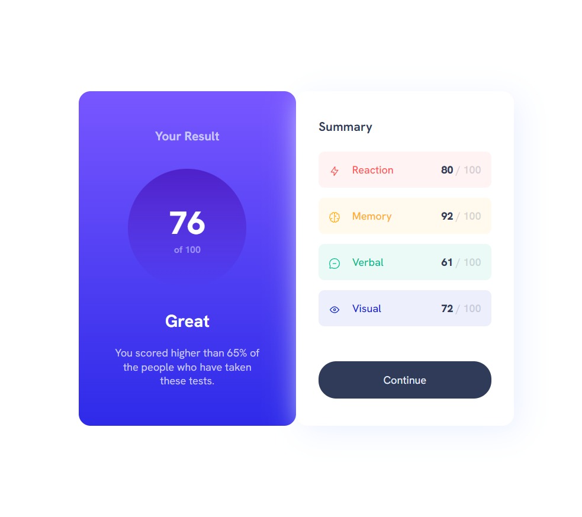

# Results summary component solution

This is a solution to the [Results summary component challenge on Frontend Mentor](https://www.frontendmentor.io/challenges/results-summary-component-CE_K6s0maV). 

## Table of contents

- [Challenge]
- [Screenshot](#screenshot)
- [Links]
- [Built with](#built-with)
- [What I learned](#what-i-learned)
- [Author](#author)


### The challenge

Users should be able to:

- View the optimal layout for the interface depending on their device's screen size
- See hover and focus states for all interactive elements on the page
- **Bonus**: Use the local JSON data to dynamically populate the content

### Screenshot



### Links

- Solution URL: 
- Live Site URL: 


### Built with

- Semantic HTML5 markup
- CSS custom properties
- Flexbox
- Bootstrap


### What I learned

This challenge was a great oportunity for me to work with a JSON file and asynchronous JavaScript for the first time. 

```js
async function fetchAndDisplayData() {
  try {
    const response = await fetch("data.json");
    const data = await response.json();

    // selecting all the images
    const allImages = document.querySelectorAll(".summary-img");
    const allTextSpans = document.querySelectorAll(".inner-text");
    const allScoreStrong = document.querySelectorAll(".the-score-inner");

    if (
      data.length !== allImages.length ||
      data.length !== allTextSpans.length ||
      data.length !== allScoreStrong.length
    ) {
      throw new Error(
        "Data length does not match the number of HTML elements."
      );
    }

    data.forEach((item, index) => {
      allImages[index].src = item.icon;
      allTextSpans[index].innerHTML = item.category;
      allScoreStrong[index].innerHTML = item.score;
    });
  } catch (error) {
    console.log("Error fetching or parsing data:", error);
    document.body.innerHTML =
      "<p>Failed to load content. Please try again later.</p>";
  }
}

fetchAndDisplayData();
```

## Author

- Frontend Mentor - [@DanielDeaconescu](https://www.frontendmentor.io/profile/DanielDeaconescu)